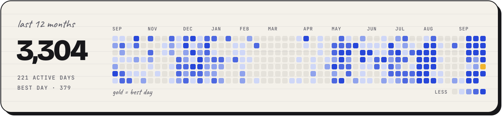

<picture>
  <source media="(prefers-color-scheme: dark)" srcset="assets/banner-dark.svg">
  
</picture>

 

I build web and mobile products end to end, and lately the AI agents inside them: the model loop, the tools it calls, the API behind it and the screens people use. Small commits, tests before anything ships, and models that draft while rules or people decide.

<a href="https://adam-dev-ai-architect.vercel.app">Portfolio</a> &nbsp;·&nbsp; <a href="mailto:chaudhrayadam@gmail.com">chaudhrayadam@gmail.com</a> &nbsp;·&nbsp; Islamabad

 

### Things I’m building

**[Jarvis](https://github.com/DevAdamExp/Jarvis)** &nbsp;`open source` 
An always-listening voice assistant for the Mac, with a SwiftUI dashboard to watch it think. Local transcription, an offline fallback, and memory it only recalls when the conversation needs it.

**Visa CRM** &nbsp;`private` · [case study](https://adam-dev-ai-architect.vercel.app/projects/visa-crm) 
A multi-tenant CRM where AI reads the CV, per-country rules make the eligibility call, and a person signs off every yes.

**[Founderflow](https://founderflowhq.ai)** 
An AI chief of staff that reads a founder’s inbox and calendar, flags what matters and drafts the replies.

**[OUIIMI](https://ouiimi.com)** 
A service-booking marketplace where slots are held inside database transactions, so two people can’t book the same time.

 

### Stack

<picture>
  <source media="(prefers-color-scheme: dark)" srcset="https://skillicons.dev/icons?i=ts%2Cnextjs%2Creact%2Cpy%2Cfastapi%2Cpostgres%2Credis%2Cdocker%2Cgcp&theme=dark">
  
</picture>

Plus React Native and Expo on mobile, and the OpenAI Agents SDK, LangGraph, MCP, Vapi and LiveKit for agents and voice.

 

### Contributions

<picture>
  <source media="(prefers-color-scheme: dark)" srcset="assets/contributions-dark.svg">
  
</picture>
